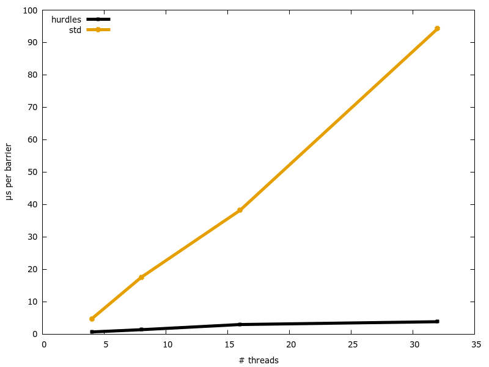

# hurdles

[](https://crates.io/crates/hurdles)
[](https://docs.rs/hurdles/)
[](https://travis-ci.org/jonhoo/arccstr)

A scalable barrier (like [`std::sync::Barrier`]) that enables multiple threads to synchronize
the beginning of some computation.

This crate provides a similar interface as [`std::sync::Barrier`], but behaves much better in
the face of many concurrently waiting threads, and incurs a lower per-thread latency penalty
(see benchmarks below). The interface does differ from the standard library barrier however:

 - `Barrier` in this crate is `Clone`, and should *not* be wrapped in a `sync::Arc`.
 - `Barrier::wait` in this crate takes a `&mut self` receiver as each thread must keep some
   local state.

Furthermore, when a thread blocks on `Barrier::wait`, the thread will (currently) *never* be
suspended, and instead spin on the barrier. For the first few spins, it will also not call
`sched_yield` to avoid the cost of thread sleep/wakeup. If threads are expected to reach the
barrier at nearly the same time, or barrier latency is critical, this is probably what you
want. However, if barriers are staggered and far between, then you may want to use
[`std::sync::Barrier`] instead, as it is better about handling long waits.

## Examples

```rust
use hurdles::Barrier;
use std::thread;

let mut handles = Vec::with_capacity(10);
let mut barrier = Barrier::new(10);
for _ in 0..10 {
    let mut c = barrier.clone();
    // The same messages will be printed together.
    // You will NOT see any interleaving.
    handles.push(thread::spawn(move|| {
        println!("before wait");
        c.wait();
        println!("after wait");
    }));
}
// Wait for other threads to finish.
for handle in handles {
    handle.join().unwrap();
}
```

## Implementation

At the time of writing, the implementation of `std::sync::Barrier` internally uses a `Mutex`,
which causes contention with many waiting threads, and incurs an undue performance overhead for
each call to `wait`.

This crate instead implements a counter-based linear barrier as described in "3.1 Centralized
Barriers" in Mellor-Crummey and Scott’s paper [Algorithms for scalable synchronization on
shared-memory multiprocessors][1] from 1991. For a higher-level explanation, see Lars-Dominik
Braun's [Introduction to barrier algorithms][2].

## Numbers

Modern laptop with 2-core (4HT) Intel Core i7-5600U @ 2.60GHz:

```text
test tests::ours_2 ... bench:         190 ns/iter (+/- 24)
test tests::std_2  ... bench:       2,054 ns/iter (+/- 822)
test tests::ours_4 ... bench:         236 ns/iter (+/- 2)
test tests::std_4  ... bench:      11,913 ns/iter (+/- 60)
```

Dell server with 2x 10-core (20HT) Intel Xeon E5-2660 v3 @ 2.60GHz across two NUMA nodes:

```text
test tests::ours_4  ... bench:         689 ns/iter (+/- 9)
test tests::std_4   ... bench:       4,762 ns/iter (+/- 151)
test tests::ours_8  ... bench:       1,380 ns/iter (+/- 13)
test tests::std_8   ... bench:      17,545 ns/iter (+/- 288)
test tests::ours_16 ... bench:       2,970 ns/iter (+/- 33)
test tests::std_16  ... bench:      38,215 ns/iter (+/- 469)
test tests::ours_32 ... bench:       3,838 ns/iter (+/- 129)
test tests::std_32  ... bench:      94,266 ns/iter (+/- 12,243)
```

[1]: https://dl.acm.org/citation.cfm?doid=103727.103729
[2]: https://6xq.net/barrier-intro/
[`std::sync::Barrier`]: https://doc.rust-lang.org/std/sync/struct.Barrier.html

Or, in plot form:


